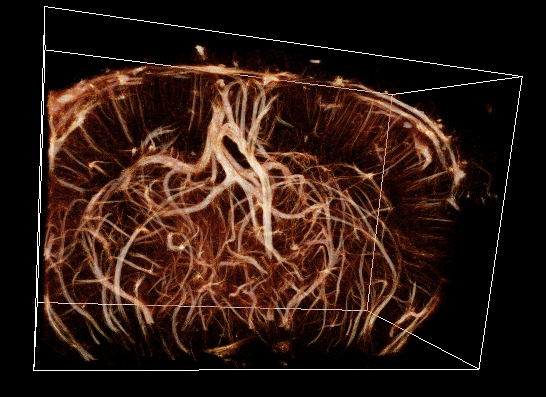
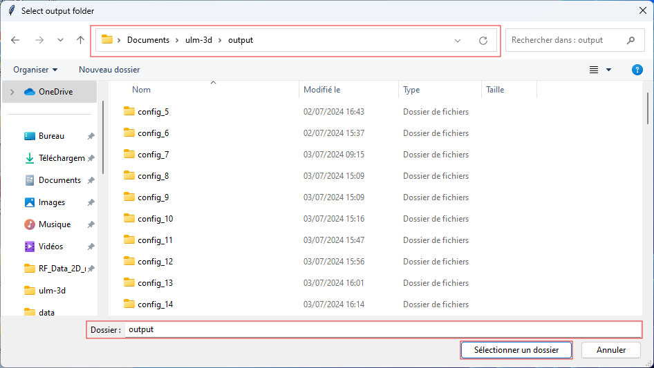

# _Open_3DULM_: 3D transcranial ultrasound localization microscopy in awake mice: protocol and open-source pipeline.


[](LICENSE.md)


<p align="center">
  
</p>

[**Open_3DULM**](https://github.com/Lab-Imag-Bio/Open-3DULM) is a numpy/scipy based framework to apply 3D ULM on ultrasound data. Its ambitions are:

- provide a basic 3D ULM pipeline for everyone.
- export localisation and tracks.
- export 3D renderings to display micro circulation.

## Table of Contents

- [Authors](#authors)
- [Academic references to be cited](#academic-references-to-be-cited)
- [Related dataset](#related-dataset)
- [Installation](#installation)
- [Getting started](#getting-started)
- [Tutorial](#tutorial)
- [Disclaimer](#disclaimer)

## Authors

- Authors: Jean-Baptiste Deloges, Jacques Bataglia, Arthur Chavignon  
- Inspired from: Baptiste Heiles  
- Supervisor: Olivier Couture  
- With the help of: Georges Chabouh, Louise Denis, Léa Davenet  

## Academic references to be cited

_3D transcranial ultrasound localization microscopy in awake mice: protocol and open-source pipeline._ Chabouh*, Denis*, Abioui-Mourgues, Deloges, Battaglia, Chavignon, Heiles, Pradier, Bodard, Vivien, Orset, and Couture. DOI: 10.1038/s44172-025-00415-4
 
## Related dataset

The beamformed in vivo dataset can be accessed here: : https://zenodo.org/records/14289690

## Features

Repository to share 3D ULM tools. With this repository it is possible to:

- Explore different configurations of 3D ULM to improve the results.
- Export localisations and tracks of microbubbles.
- Export 3D volumes of micro circulation for 3D rendering.

## Installation

### Requirements

- [**Run with Python 3.11.9**](https://www.python.org/downloads/release/python-3119/): Please install this version to avoid issue with compatibility.
Download and install with the executable file or write in the command line:

``` bash
winget install python.python.3.11
```

In the terminal check your version of Python.

``` bash
python -V
```

### Virtal environement

Create your virtual environement with venv.
(Be sure to have the correct version of Python):

``` bash
python -m venv my_env
```

Activate your new virtual environement:

- On Windows:

``` bash
my_env\Scripts\activate.bat
```

- On Linux and MacOs:

``` bash
source my_env/bin/activate
```

### Installation of the project

Clone the repo from GitHub:

``` bash
git clone https://github.com/Lab-Imag-Bio/Open-3DULM.git
```

With terminal go to the root of the project.

``` bash
cd ulm-3d
```

Then install packages that are needed to use the project and the module `ulm3d` as editable:

``` bash
python -m pip install --upgrade pip
pip install -r .\src\requirements.txt
pip install -e .\src\.
```

## Getting started

The project is structured as follow:

``` bash
├───config
│   └───basic_config.yaml
├───scripts
│   ├───display_3D_ulm.yaml
│   └───open_3D_ulm_main.yaml
├───src
│   ├───setup.py
│   ├───requirements.txt
│   └───ulm3d
│       ├───ulm.py
│       ├───loc
│       │    └───radial_symetry_center.py
│       └───utils
│            ├───create_archi_export.py
│            ├───export.py
│            ├───load_data.py
│            ├───matlab_tool.py
│            ├───power_doppler.py
│            ├───render.py
│            └───type_config_file.py
└───doc
```

- [`config/`](/config/): contains config file to run 3D ULM pipeline.
- [`scripts/`](/scripts/) : contains main_script to run the code.
- [`src/ulm3d/`](/src/ulm3d/): contains the ulm3d module with the ULM class.
- [`src/ulm3d/loc/`](/src/ulm3d/loc/): contains localisation script (RadialSymmetry).
- [`src/ulm3d/utils/`](/src/ulm3d/utils/): contains utils script to run the code and export scripts for tracks, localizations and 3D renderings.

## Tutorial

1. Update the configuration file based on your data and compute capabilities:
The configuration file is located in the **config** folder. You can add your own configuration file written in YAML. The file _basic_config.yaml_ serves as a reference, containing all the available parameters and their documentation.
**To run the code in parallel, increase the number of workers.**
:warning: Please note that the code may require a significant amount of RAM. Gradually increase the number of workers to avoid overloading your system.

2. In the command line in your virtual environement write:

``` bash
python scripts/open_3D_ulm_main.py  [--config-file str] [--output str] [--verbose-level int] [ --workers int]
```

- `verbose-level`: shoud be an int: 0: INFO, 1: DEBUG, 2: TRACE. (default 1)
- `workers`: number of max workers to use, 1 for single thread.

You can run the code in your favorite IDLE too. Please, be sure to select the virtual environement you have created to run the code from your IDLE.  
:warning: If you want to use your own IQ, please change the `input_var_name` in your config_file to the corresponding variable name of your IQs.

3.Select the config file in YAML (select [_basic_config.yaml_](/config/basic_config.yaml) if you want to use the default settings for 3D awake mice).

<p align="center">
  
</p>

4.Select the IQ files to load.
Current files supported are:

- npy
- npz
- mat

**Be sure that the name of the variable is the same that `input_var_name` in the config file.** (for .mat and .npz format).
<p align="center">
  
</p>

5. Select the folder to save your data.
<p align="center">
  
</p>

6.When the code will finish to run, you can access to your data in the last 'config_'. The config folder stores the config file and locs, tracks and 3D render volumes in separated files according to the parameters in the config file.
<p align="center">
  
</p>
<p align="center">
  
</p>

7.Display MIP insensity renderings:

```bash
python scripts/display_3D_ulm.py  [--input str] [--verbose-level int] [--show] [--scale {pixel, mm}]
```

## DISCLAIMER

THIS SOFTWARE IS PROVIDED BY THE AUTHORS AND CONTRIBUTORS "AS IS" AND ANY EXPRESS OR IMPLIED WARRANTIES, INCLUDING, BUT NOT LIMITED TO, THE IMPLIED WARRANTIES OF MERCHANTABILITY AND FITNESS FOR A PARTICULAR PURPOSE ARE DISCLAIMED. IN NO EVENT SHALL THE AUTHORS AND CONTRIBUTORS BE LIABLE FOR ANY DIRECT, INDIRECT, INCIDENTAL, SPECIAL, EXEMPLARY, OR CONSEQUENTIAL DAMAGES (INCLUDING, BUT NOT LIMITED TO, PROCUREMENT OF SUBSTITUTE GOODS OR SERVICES; LOSS OF USE, DATA, OR PROFITS; OR BUSINESS INTERRUPTION) HOWEVER CAUSED AND ON ANY THEORY OF LIABILITY, WHETHER IN CONTRACT, STRICT LIABILITY, OR TORT (INCLUDING NEGLIGENCE OR OTHERWISE) ARISING IN ANY WAY OUT OF THE USE OF THIS SOFTWARE, EVEN IF ADVISED OF THE POSSIBILITY OF SUCH DAMAGE.
